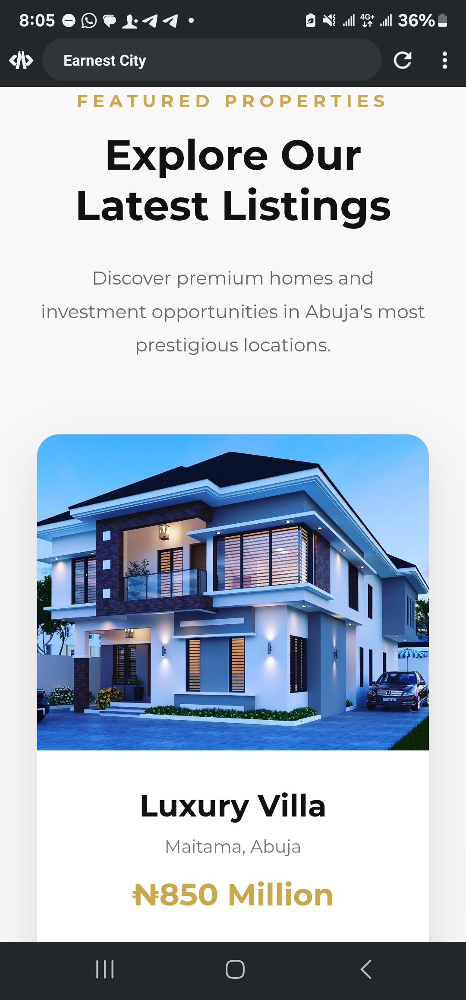
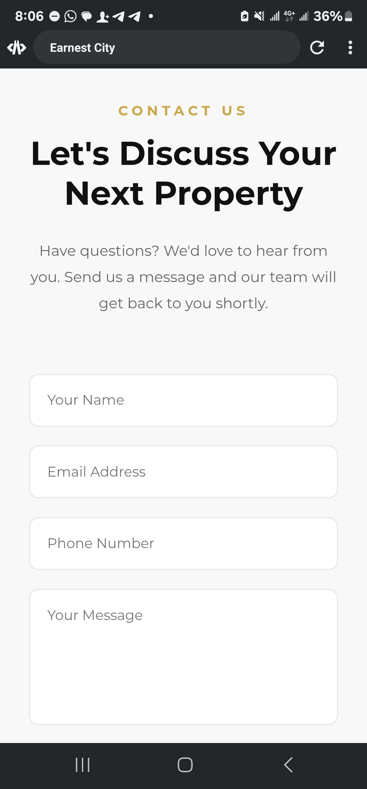

# 🏙️ Earnest City Real Estate Website

A modern, responsive real estate landing page built with **HTML5, CSS3, and JavaScript**. The website showcases luxury properties in Abuja with a clean user interface, smooth animations, and a mobile-friendly layout.

---

## 🌐 Live Demo

> Add your GitHub Pages link here after deployment.

Example:

https://onazi4real.github.io/earnest-city-real-estate/

---

## 📸 Website Preview

### Hero Section


---

### About Section



---

### Featured Properties


---

### Contact Section



---

## ✨ Features

- Responsive Design
- Sticky Navigation Bar
- Mobile Navigation Menu
- Hero Section Animation
- About Section
- Featured Properties
- Why Choose Us Section
- Call to Action Banner
- Animated Statistics Counter
- Client Testimonials
- Contact Form
- Floating WhatsApp Button
- Back-to-Top Button
- Smooth Scrolling

---

## 🛠️ Technologies Used

- HTML5
- CSS3
- JavaScript

---

## 📁 Project Structure

```text
earnest-city-real-estate/
│── index.html
│── style.css
│── script.js
│── images/
└── screenshot/
```

---

## 👨‍💻 Author

**Okpanachi Ogwu**

GitHub: https://github.com/Onazi4real

---

⭐ If you like this project, please consider giving it a star.
